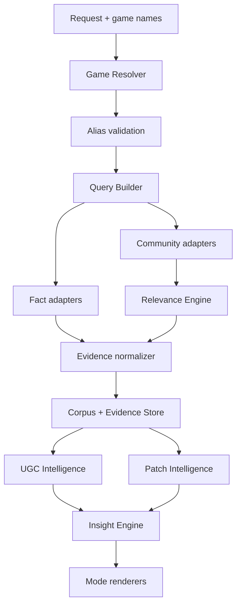
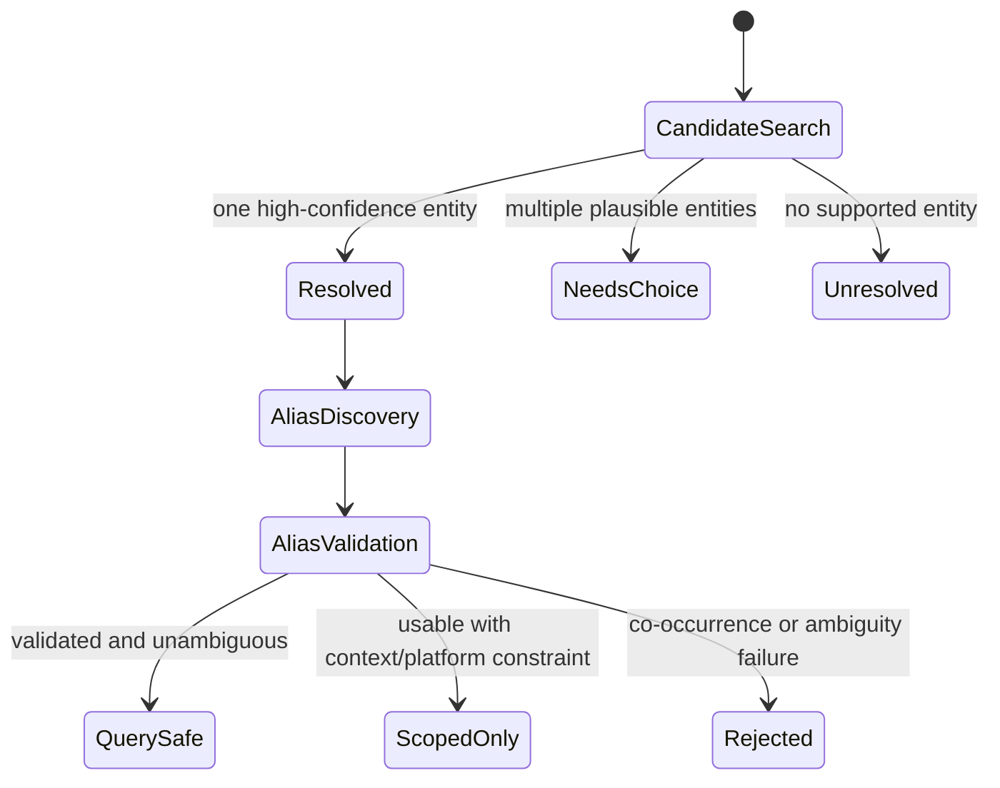
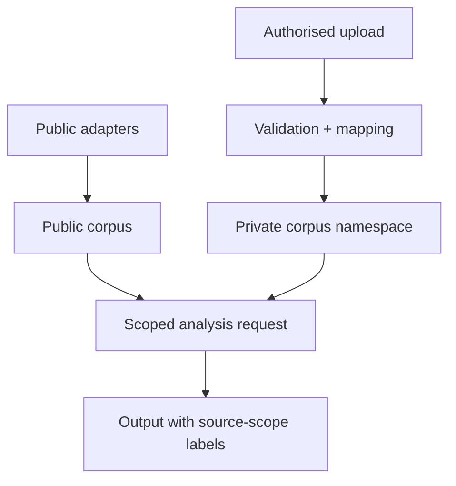

# PlayerVoice architecture

Status: target architecture. Existing runnable GamePulse modules remain the baseline until their corresponding migration Issues are completed.

## System boundary

PlayerVoice owns game identity, query planning, source orchestration, normalization, relevance, corpus construction, evidence-linked analysis, and mode rendering. It does not own platform credentials, bypass access controls, or infer first-party behavioural impact from public UGC.

## Component model



### Core boundaries

| Component | Owns | Must not own |
| --- | --- | --- |
| Game Resolver | canonical identity, external IDs, candidates, resolution confidence | community sentiment |
| Alias Service | alias discovery, evidence, ambiguity, validation, search safety | arbitrary keyword expansion |
| Query Builder | source/language/intent query matrix | network calls |
| Fact Retrieval | verifiable fact claims and official update records | player opinions |
| Source Adapters | source-specific retrieval and native pagination | topic classification or mode formatting |
| Relevance Engine | relevant/ambiguous/irrelevant labels with reasons | sentiment |
| Corpus Builder | normalization, deduplication, access-scope isolation | causal conclusions |
| UGC Intelligence | topics, stance/sentiment, pain points, behaviour signals | source collection |
| Evidence Store | immutable evidence/provenance links and run coverage | prose summaries without references |
| Insight Engine | evidence-backed claims, contradictions, uncertainty, priority | universal recommendation scores |
| Mode Renderers | audience-specific selection and presentation | duplicate retrieval/analysis pipelines |

## Planned repository tree

The tree is deliberately compact for a seven-day MVP. Files marked `[interface]` define contracts but need no full implementation in week one.

```text
playervoice/
├── README.md
├── SPECIFICATION.md
├── ARCHITECTURE.md
├── DATA_SCHEMA.md
├── ISSUES.md
├── requirements.txt
├── config/
│   ├── taxonomy.yaml
│   ├── sources.yaml
│   └── example.request.yaml
├── schemas/
│   ├── game_entity.schema.json
│   ├── fact_record.schema.json
│   ├── evidence_item.schema.json
│   ├── insight.schema.json
│   └── run_manifest.schema.json
├── gamepulse/                       # keep current import path during MVP
│   ├── models.py
│   ├── resolver.py
│   ├── aliases.py
│   ├── query_builder.py
│   ├── relevance.py
│   ├── corpus.py
│   ├── facts.py
│   ├── evidence.py
│   ├── intelligence.py
│   ├── patch_intelligence.py       # [interface in MVP]
│   ├── private_ingestion.py        # [interface in MVP]
│   ├── modes/
│   │   ├── player.py
│   │   ├── creator.py
│   │   ├── analyst.py              # [thin/interface in MVP]
│   │   └── compare.py
│   └── collectors/                  # plugin-style source adapters
│       ├── base.py
│       ├── official.py
│       ├── steam.py
│       ├── reddit.py
│       ├── bilibili.py
│       ├── authorised_import.py
│       └── stubs/                  # TapTap/Weibo/XHS/Douyin/app stores
├── scripts/
│   └── gamepulse.py                 # existing CLI, PlayerVoice branding
├── skill/game-voice-intelligence/   # keep current skill path during MVP
│   ├── SKILL.md
│   └── references/
├── tests/
│   ├── unit/
│   ├── contract/
│   ├── integration/
│   ├── e2e/
│   └── fixtures/
├── examples/
│   ├── player_mode/
│   ├── creator_brief/
│   └── compare_mode/
├── data/                            # ignored runtime data except fixtures
└── demo/                            # current synthetic SQL demonstration
```

### Migration rule

Keep the current `gamepulse/` Python import path during the seven-day MVP. Product branding changes to PlayerVoice, but a package rename has no direct MVP value and would create avoidable churn. Existing modules are split or wrapped incrementally by contract, with tests moved in the same Issue; there must never be two live implementations of the same component.

## Request contract

```yaml
request_id: optional-client-id
mode: player | creator | analyst | compare
games:
  - query: 无限暖暖
    entity_id: optional-pre-resolved-id
languages: [zh-CN, en]
sources: [official, steam, reddit, bilibili]
time_range:
  start: null
  end: null
research_intents: [general, performance, controls, patch]
preferences: null
private_dataset_ids: []
```

Validation rules:

- `compare` requires two or more games;
- `private_dataset_ids` are accepted only when the caller is authorised;
- unresolved or ambiguous games return candidates rather than silently picking one;
- source availability and per-source query plans are returned before or with collection.

## Source adapter contract

Every adapter implements the same conceptual interface:

```python
class SourceAdapter(Protocol):
    name: str
    access_model: str

    def capabilities(self) -> SourceCapabilities: ...
    def search(self, plan: QueryPlan, cursor: str | None = None) -> SourcePage: ...
    def normalize(self, native_item: Mapping[str, Any], context: RetrievalContext) -> EvidenceItem: ...
```

`SourceCapabilities` declares supported evidence kinds, languages, query intents, pagination, authentication, and rate-limit behaviour. An adapter returns source-native records; it never performs global sentiment or priority analysis.

Restricted platforms may provide a licensed-provider or authorised-export adapter. Placeholder adapters report `unavailable` with a reason and must never imply collection.

## Resolver and alias flow



Resolution never depends on one string-similarity score alone. Candidate ranking should combine exact/localized title match, official or trusted IDs, developer/publisher context, platform listing, release context, and requested locale.

## Query Builder

The builder produces a matrix over:

`Game identity × language × source × research intent`

Each `QueryPlan` stores the exact query, aliases used, why each alias is safe, source constraints, and expected evidence kind. High-ambiguity aliases require another disambiguator such as developer, character, platform, or canonical title.

Initial intent set:

`general`, `review`, `performance`, `optimisation`, `graphics`, `audio`, `controls`, `bugs`, `story`, `characters`, `combat`, `exploration`, `progression`, `grind`, `daily`, `monetisation`, `gacha`, `pvp`, `endgame`, `churn`, `uninstall`, `feature_request`, `update`, `patch`, `controversy`.

## Evidence and corpus flow

1. Retrieval writes a run manifest and raw source item reference.
2. Normalization creates an `EvidenceItem` without losing source-native signals.
3. Relevance adds a label, score, reasons, and model/rule version.
4. Only `relevant` records enter the default analysis corpus; `ambiguous` records remain reviewable.
5. Corpus deduplication uses source IDs first and content fingerprints only as a secondary cross-post signal.
6. UGC analysis adds multi-label topics and other derived annotations as versioned analysis records.
7. Insights cite supporting, contradicting, and contextual evidence IDs.

## Fact Layer vs Player Evidence Layer

They share provenance primitives but remain separate record types.

| Fact Layer | Player Evidence Layer |
| --- | --- |
| developer, release date, platforms | control feel, stuttering, grind |
| minimum/recommended requirements | real-world hardware reports |
| cross-play/cross-save policy | whether cross-play feels reliable |
| official patch notes | player reaction before/after patch |
| source authority and valid dates | relevance, topic, sentiment/stance |

A mode renderer may place both in one section only when each statement retains its layer label and evidence.

## Patch Intelligence architecture

`PatchRecord` is an official fact object with version, release time, change items, and source references. Each change item maps to taxonomy nodes. Patch analysis creates explicit pre/post windows and compares normalized topic share, negative share, bug/performance reports, and behaviour signals. The output records sample sizes, source mix, coverage changes, and a non-causality warning.

Patch windows are configurable and anchored to the official effective timestamp. If platform rollout times differ, the comparison is platform-specific.

## Private data architecture

Public and private data share the `EvidenceItem` shape but never the same namespace or default retrieval scope.



Required controls:

- `access_scope` defaults to `private` for uploads;
- dataset ownership/authorisation is checked before retrieval;
- exported outputs retain public/private labels;
- private evidence is excluded from global examples, caches, and public reports;
- ingestion stores a schema-mapping manifest and rejects unknown required fields;
- deletion/retention hooks are specified even if the MVP uses local storage.

## Failure and observability model

Every run records per-source status, request counts, item counts, exclusions by reason, query plans, timestamps, and errors safe for logs. A partial run can succeed. The final output must expose collection gaps and cannot calculate a comparison as though missing games or sources were zero.

## Overengineering guardrails

- Use files/SQLite and typed models in the MVP; do not introduce a service mesh, queue, vector database, or distributed worker system.
- Keep one process and one CLI until a second client genuinely requires an API server.
- Use deterministic rules plus inspectable scores before adding complex classifiers.
- Store interfaces for private data and patch analysis before building their full workflows.
- Do not build the dashboard during the seven-day core milestone.
