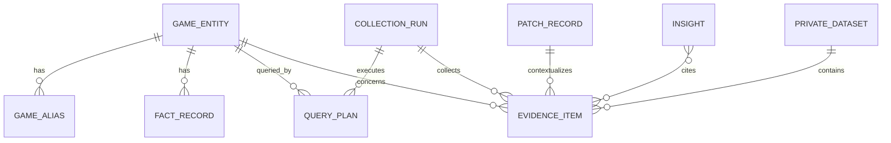

# PlayerVoice data schema

Status: logical contract for implementation. JSON Schema files listed in the target tree are generated or hand-written in P0 Issue 1 after this contract is accepted.

## Conventions

- IDs are stable strings with a type prefix, for example `game_`, `ev_`, `fact_`, `insight_`, `run_`.
- Timestamps use ISO 8601 with timezone.
- Language uses BCP 47 where known, for example `zh-CN` or `en`.
- Enumerated states are lowercase snake case.
- Raw source payloads may be retained in protected raw storage, but normalized records do not store unnecessary personal identifiers.
- Derived fields always include a method/version and confidence where applicable.
- Public and private evidence share a shape but not an access namespace.

## Entity relationship overview



## 1. GameEntity

Required fields:

| Field | Type | Meaning |
| --- | --- | --- |
| `game_id` | string | Stable canonical ID, not derived only from display title |
| `canonical_title` | string | Preferred display title for the request locale |
| `original_title` | string/null | Original-market title when known |
| `localized_titles` | object | BCP-47 language → title |
| `external_ids` | object | Namespaced IDs such as `steam_app_id`, `wikidata_id` |
| `developers` | string[] | Verified developer names |
| `publishers` | string[] | Verified publisher names |
| `resolution_status` | enum | `resolved`, `needs_choice`, `unresolved` |
| `resolution_confidence` | number | 0–1 |
| `resolution_evidence_ids` | string[] | Fact/source records supporting identity |
| `resolved_at` | datetime | Resolution time |

Optional fields: `release_dates`, `genres`, `franchise`, `official_urls`, and `platforms`.

## 2. GameAlias

| Field | Type | Required | Meaning |
| --- | --- | ---: | --- |
| `alias_id` | string | yes | Stable alias record ID |
| `game_id` | string | yes | Canonical game |
| `text` | string | yes | Exact alias text |
| `normalized_text` | string | yes | Comparison form; original remains unchanged |
| `language` | string/null | yes | BCP 47 when known |
| `alias_type` | enum | yes | `official_title`, `localized_title`, `abbreviation`, `transliteration`, `community_nickname`, `common_misspelling` |
| `source_evidence_ids` | string[] | yes | Evidence for treating the term as an alias |
| `source_platforms` | string[] | yes | Where the alias is observed/appropriate |
| `confidence` | number | yes | 0–1 |
| `ambiguity` | enum | yes | `none`, `low`, `medium`, `high` |
| `ambiguity_notes` | string/null | no | Competing meanings/entities |
| `validation_status` | enum | yes | `validated`, `scoped_only`, `rejected`, `pending` |
| `search_enabled` | boolean | yes | Whether any query may use it |
| `standalone_search_safe` | boolean | yes | Whether it may appear without a disambiguator |

Invariants:

- `high` ambiguity implies `standalone_search_safe: false`;
- `rejected` implies `search_enabled: false`;
- co-occurrence with the game is not sufficient alias evidence;
- aliases never replace the canonical entity ID in joins.

## 3. FactRecord

Fact records are atomic, sourced claims rather than one mutable game metadata blob.

| Field | Type | Meaning |
| --- | --- | --- |
| `fact_id` | string | Stable fact record ID |
| `game_id` | string | Canonical game |
| `fact_type` | enum/string | e.g. `developer`, `platform_support`, `minimum_requirements`, `controller_support`, `cross_save`, `current_version` |
| `value` | scalar/object/list | Typed fact value |
| `unit` | string/null | Unit where applicable |
| `valid_from`, `valid_to` | datetime/null | Version/time validity |
| `territory` | string/null | Region scope |
| `platform` | string/null | Platform scope |
| `source_evidence_id` | string | Official or reputable source evidence |
| `source_authority` | enum | `official`, `platform_store`, `reputable_third_party` |
| `verification_status` | enum | `verified`, `conflicting`, `unverified` |
| `confidence` | number | 0–1 |
| `retrieved_at` | datetime | Retrieval time |

Conflicting fact records remain stored and are surfaced; one is not silently overwritten.

## 4. QueryPlan

| Field | Type | Meaning |
| --- | --- | --- |
| `query_id` | string | Stable within a run |
| `run_id`, `game_id` | string | Execution and entity scope |
| `source` | string | Target adapter |
| `language` | string | Query language |
| `intent` | enum | Research intent from the approved intent list |
| `query_text` | string | Exact submitted query |
| `alias_ids` | string[] | Aliases used |
| `disambiguators` | string[] | Developer, platform, character, version, etc. |
| `expected_evidence_kind` | enum | `fact`, `patch_note`, `review`, `post`, `comment`, `video` |
| `generated_at` | datetime | Generation time |

Every collected public item should be traceable to a `query_id` unless it came from a direct entity endpoint, in which case `retrieval_method` records that route.

## 5. EvidenceItem

This is the common evidence envelope for facts, official content, UGC, and authorised private records.

### Identity and scope

| Field | Type | Required |
| --- | --- | ---: |
| `evidence_id` | string | yes |
| `game_id` | string | yes |
| `evidence_kind` | enum: `official`, `fact_source`, `patch_note`, `review`, `post`, `comment`, `video`, `survey_response`, `support_record` | yes |
| `access_scope` | enum: `public`, `private` | yes |
| `dataset_id` | string/null | yes |

### Source and content

| Field | Type | Required |
| --- | --- | ---: |
| `source` | string | yes |
| `source_content_id` | string | yes |
| `parent_evidence_id` | string/null | no |
| `source_url` | string/null | no |
| `source_reference` | string/null | no; used when a public URL is unavailable |
| `title` | string/null | no |
| `original_text` | string | yes |
| `normalized_text` | string/null | no |
| `language` | string/null | yes |
| `published_at` | datetime/null | yes; field is present even when the source exposes no publication time |
| `retrieved_at` | datetime | yes |

### Retrieval and relevance

| Field | Type | Required |
| --- | --- | ---: |
| `run_id` | string | yes |
| `query_id` | string/null | no |
| `matched_alias_ids` | string[] | yes |
| `retrieval_method` | enum: `api`, `public_endpoint`, `official_feed`, `licensed_provider`, `authorised_export`, `user_upload` | yes |
| `relevance_label` | enum: `relevant`, `ambiguous`, `irrelevant`, `pending` | yes |
| `relevance_score` | number/null | no |
| `relevance_reasons` | string[] | yes |
| `relevance_method_version` | string/null | no |

### Native signals

Optional: `recommended`, `rating`, `rating_scale`, `engagement`, `reply_count`, `playtime_hours`, `platform`, `hardware_context`, `version_context`, and `source_metadata`.

Do not flatten platform-native recommendation/rating into model-derived sentiment.

### Provenance

```yaml
provenance:
  source_class: official | platform_store | public_community | licensed_provider | user_provided | internal
  collector_version: string
  terms_or_permission_reference: optional string
  content_checksum: string
  raw_snapshot_reference: optional string
  contains_personal_data: boolean
  redaction_status: not_required | redacted | pending
```

## 6. AnalysisAnnotation

Annotations are versioned and may be recomputed without mutating the evidence record.

| Field | Type | Meaning |
| --- | --- | --- |
| `annotation_id` | string | Stable annotation ID |
| `evidence_id` | string | Evidence target |
| `taxonomy_version` | string | Taxonomy used |
| `primary_topic` | string/null | Most material topic |
| `secondary_topics` | string[] | Other supported topics |
| `sentiment_label` | enum | `positive`, `negative`, `mixed`, `neutral`, `unknown` |
| `sentiment_score` | number/null | Model/rule score, not source-native rating |
| `pain_points` | string[] | Explicit or inferred pain points |
| `underlying_needs` | string[] | Needs inferred from evidence |
| `explicit_feature_requests` | string[] | Requests stated by the player |
| `behaviour_signals` | string[] | Taxonomy-controlled signals |
| `analysis_confidence` | number | 0–1 |
| `method` | object | Rule/model name, version, prompt/config hash |
| `requires_human_review` | boolean | Review flag |

## 7. Insight

| Field | Type | Meaning |
| --- | --- | --- |
| `insight_id` | string | Stable insight ID |
| `scope_type` | enum | `game`, `comparison`, `patch`, `segment` |
| `scope_ids` | string[] | Game/patch/segment IDs |
| `mode` | enum | `player`, `creator`, `analyst`, `compare` |
| `insight_type` | enum | `fact_summary`, `praise`, `complaint`, `controversy`, `pain_point`, `need`, `opportunity`, `difference`, `preference_match`, `research_gap` |
| `statement` | string | Evidence-bounded claim |
| `taxonomy_nodes` | string[] | Comparable dimensions |
| `confidence` | number | 0–1 |
| `supporting_evidence_ids` | string[] | Evidence supporting the claim |
| `challenging_evidence_ids` | string[] | Contradictory or dissenting evidence |
| `context_evidence_ids` | string[] | Contextual facts/patch records |
| `sample_scope` | object | Counts, sources, dates, languages, filters |
| `uncertainty` | string[] | Known gaps and caveats |
| `priority` | object/null | Decision-support dimensions and label |
| `generated_at` | datetime | Generation time |

An insight with no evidence IDs is invalid. A product opportunity must identify whether it came from an explicit request or an inferred need.

## 8. PatchRecord

| Field | Type | Meaning |
| --- | --- | --- |
| `patch_id`, `game_id` | string | Identity |
| `release_type` | enum | `release`, `major_update`, `patch`, `hotfix` |
| `version` | string/null | Official version label |
| `title` | string | Official title |
| `published_at`, `effective_at` | datetime | Announcement and effective time |
| `platforms`, `territories` | string[] | Scope |
| `change_items` | object[] | Atomic change + mapped taxonomy nodes |
| `official_evidence_ids` | string[] | Official source evidence |
| `previous_patch_id` | string/null | Version relation |

Patch comparison output additionally stores `pre_window`, `post_window`, source mix, record counts, normalized topic shares, and causal-language guard status.

## 9. PrivateDataset

| Field | Type | Meaning |
| --- | --- | --- |
| `dataset_id` | string | Private namespace key |
| `owner_scope` | string | User/workspace/organisation boundary |
| `name` | string | User-facing label |
| `source_type` | enum | `csv`, `json`, `excel`, `survey`, `support_export`, `community_export`, `research_dataset` |
| `authorisation_attested` | boolean | Caller confirms permitted use |
| `schema_mapping` | object | Original → PlayerVoice fields |
| `allowed_modes` | string[] | Explicit use scope |
| `retention_policy` | object | Retention/deletion setting |
| `created_at` | datetime | Ingestion time |
| `status` | enum | `validating`, `ready`, `rejected`, `deleted` |

## 10. CollectionRun manifest

The manifest records `run_id`, request hash, game IDs, query plans, code/config/taxonomy versions, start/end time, and per-source status:

```yaml
status: collected | partial | unavailable | disabled | failed
queries_attempted: 0
items_retrieved: 0
items_relevant: 0
items_ambiguous: 0
items_irrelevant: 0
duplicates: 0
error_code: null
reason: null
```

## MVP persistence

The MVP may use JSONL plus SQLite/CSV-derived views. The logical contracts above are stable even if storage changes later. A vector database, graph database, and event bus are intentionally out of scope for week one.
