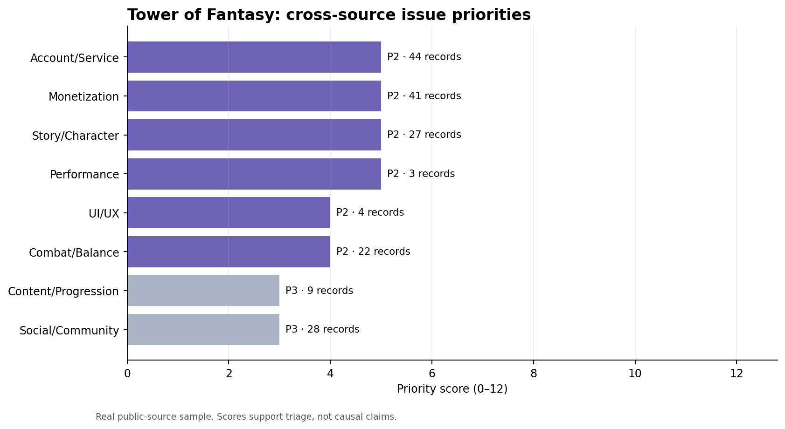
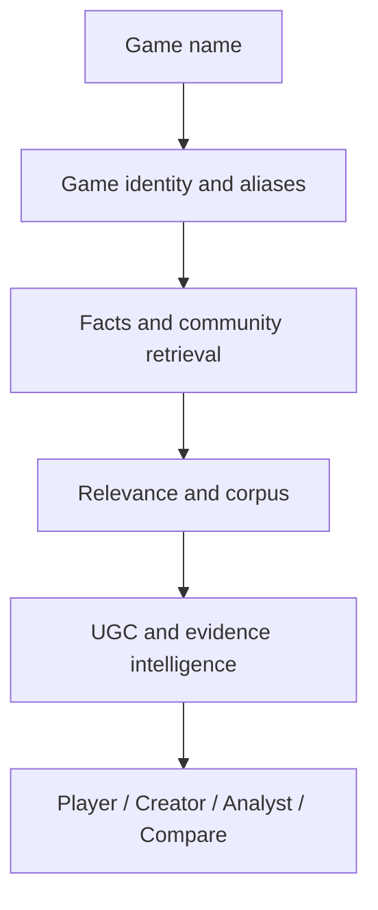

# PlayerVoice

**An evidence-backed game research skill for players, creators and analysts.**

**Search a game once. Understand how it runs, how it plays, what changed, what players think, and why it matters.**

PlayerVoice starts with a game name and builds a traceable research corpus from
verified game facts and public community discussion. One Intelligence Core
serves four interfaces: Player, Creator, public-corpus Analyst, and Compare.
Authorised private data remains a later interface/spec, not a capability claim.

This repository contains the working Issues 1–10 Intelligence Core, the Issue
10.5 quality gate, and the current phase's Issue 11–14 Mode layer:

`Game Name → Resolver → Alias Validation → Query Plans → Official Fact Layer`

`Query Plan → Source Adapter → Relevant Corpus → Structured Insight → Original Evidence`

`Shared Intelligence Core → Player / Creator / Analyst / Compare`

Implementation intentionally stops before Issue 15. Patch Intelligence,
private ingestion, dashboards, API servers, vector databases, and enterprise
infrastructure are not implemented.

The frozen design and implementation backlog are documented in:

- [`SPECIFICATION.md`](SPECIFICATION.md) — product boundaries and mode contracts;
- [`ARCHITECTURE.md`](ARCHITECTURE.md) — target system design and repo tree;
- [`DATA_SCHEMA.md`](DATA_SCHEMA.md) — entity, fact, evidence, insight, patch, and private-data contracts;
- [`config/taxonomy.yaml`](config/taxonomy.yaml) — cross-game core taxonomy with genre extensions;
- [`ISSUES.md`](ISSUES.md) — ordered Copilot-ready implementation backlog.

| Capability | Status | Evidence |
| --- | --- | --- |
| Resolver, aliases, query plans, Fact Layer | Implemented | 57-test Issue 1–5 baseline and `examples/foundation/` |
| Source adapters and query provenance | Implemented | Steam/Bilibili live; Reddit OAuth-aware; restricted-source stubs |
| Relevance, corpus, deduplication | Implemented | SQLite Evidence Store, review queue, retained query links |
| Taxonomy and UGC annotations | Implemented baseline | Versioned transparent bilingual rules and `annotations.jsonl` |
| Evidence-linked insights and coverage | Implemented baseline | `examples/e2e/` reports with source traceback |
| Corpus & Taxonomy quality gate | Implemented | Full 39-item audit; precision-first `other_unclassified` handling |
| Player / Creator / public Analyst / Compare Modes | Implemented | Shared core, typed outputs, CLI, JSON/Markdown demos |
| Private data, Patch Intelligence, dashboard/API/vector DB | Not implemented | Explicitly deferred to Issue 15+ |

Run the new foundation slice without collecting UGC:

```bash
python scripts/gamepulse.py foundation --game "无限暖暖" --locale zh-CN
python scripts/gamepulse.py plan --game "Counter-Strike 2" --languages zh-CN,en
```

Three live Issue 1–5 outputs are checked in under [`examples/foundation/`](examples/foundation/). See the [Issue 1–5 Implementation Review](docs/ISSUE_1_5_IMPLEMENTATION_REVIEW.md) for test results, limitations and the real/interface boundary.

Run the complete Issue 1–10 slice:

```bash
python scripts/gamepulse.py voice-slice \
  --game "无限暖暖" \
  --output examples/e2e/infinity-nikki
```

Live outputs for Infinity Nikki, PUBG: BATTLEGROUNDS, and Counter-Strike 2 are
checked in under [`examples/e2e/`](examples/e2e/). See the
[Issue 6–10 Implementation Review](docs/ISSUE_6_10_IMPLEMENTATION_REVIEW.md)
and [Issue 10 design notes](docs/insights.md).

Render Modes from an existing Intelligence Core result without recollecting or
reclassifying data:

```bash
python scripts/gamepulse.py mode \
  --mode player \
  --input-dir examples/e2e/infinity-nikki \
  --preferences "我每天只有一个小时，喜欢剧情和画面，不喜欢重 PvP" \
  --output examples/modes/player/infinity-nikki

python scripts/gamepulse.py mode \
  --mode compare \
  --input-dir examples/e2e/infinity-nikki \
  --input-dir examples/e2e/pubg-battlegrounds \
  --input-dir examples/e2e/counter-strike-2 \
  --output examples/modes/compare/technical-three-games
```

See the [Mode Layer Implementation Review](docs/PLAYERVOICE_MODE_LAYER_IMPLEMENTATION_REVIEW.md),
the [taxonomy gap analysis](docs/taxonomy_gap_analysis.md), and the individual
Issue 11–14 reviews for real outputs and limitations.

```bash
python scripts/gamepulse.py run --game "Tower of Fantasy"
python scripts/gamepulse.py run --game "无限暖暖"
```

The legacy `run` command remains available for compatibility. New Issue 6–10
validation and evidence-linked output use the `voice-slice` command.



## What is real in this repository?

The committed example report contains **327 real public records** collected for *Tower of Fantasy*:

| Source | Records | Collection route |
| --- | ---: | --- |
| Steam | 300 | Store review endpoint, resolved from the game name |
| Bilibili | 27 | Video search for `幻塔`, followed by public reply collection |

See the [live report](reports/tower-of-fantasy/voice_of_player_report.md), [source manifest](data/raw/latest_manifest.json), and [normalized dataset](data/processed/voice.csv).

Synthetic behavioural telemetry from the first prototype is retained only under [`demo/`](demo/) for offline SQL demonstrations. It is not presented as the core product.

## Platform coverage

| Platform | Game-name discovery | Comment collection | Access model |
| --- | --- | --- | --- |
| Steam | Automatic | Automatic | Public endpoint; live-tested |
| Bilibili | Automatic using Chinese alias | Automatic | Public web endpoints; live-tested and rate-limited |
| Reddit | Automatic global/subreddit search | Automatic | Official OAuth credentials |
| YouTube | Automatic video search | Automatic | Official Data API key and quota |
| Weibo | Search through approved Open/Commercial API | Automatic when approved | API scope/token or authorized export |
| Xiaohongshu | Licensed provider or authorized session | Provider/session dependent | Authorized export fallback |
| Douyin | Approved Open/Game Partner API or provider | Scope dependent | Authorized export fallback |
| Discord | Channel selected by owner/admin | Import messages | Authorized export or bot access |

GamePulse does not bypass login, CAPTCHA, rate limits, or platform access controls. Restricted platforms are shown as `unavailable` until valid access or an authorized export is provided. This is deliberate: a useful monitoring tool must distinguish missing data from negative evidence.

## Intelligence Core



For example, the discovery layer can resolve an English title to a Chinese platform query (`Tower of Fantasy → 幻塔`) or use an English alias for global search (`无限暖暖 → Infinity Nikki`) when current public metadata supplies it. A fixed YAML config can override incomplete aliases.

Preview discovery without collecting:

```bash
python scripts/gamepulse.py discover --game "Tower of Fantasy"
```

## Installation

```bash
python -m venv .venv
source .venv/bin/activate
pip install -r requirements.txt
```

Optional credentials are read from environment variables and are never written to the dataset:

```bash
export REDDIT_CLIENT_ID="..."
export REDDIT_CLIENT_SECRET="..."
export YOUTUBE_API_KEY="..."
export WEIBO_PROVIDER_ENDPOINT="https://provider.example/weibo/search"
export WEIBO_ACCESS_TOKEN="..."
```

Use [`config/example.yml`](config/example.yml) when you need fixed aliases, limits, source selection, or repeatable monitoring:

```bash
python scripts/gamepulse.py run --config config/example.yml --fresh
```

## Restricted Chinese platforms and community data

Weibo, Xiaohongshu, and Douyin do not offer the same unrestricted general comment-search route as Steam. GamePulse includes executable adapters for approved platform/provider access, plus a portable authorized-export route. After the relevant endpoint and token are configured once, the normal `run --game` command sends the resolved Chinese game alias as the search query.

The provider endpoint contract is documented in [`docs/provider_contract.md`](docs/provider_contract.md). It is intentionally vendor-neutral, so an approved in-house gateway or licensed data supplier can be connected without changing the analysis pipeline.

```bash
python scripts/gamepulse.py import \
  --game "无限暖暖" \
  --platform xiaohongshu \
  --file exports/xhs_comments.csv

python scripts/gamepulse.py analyze --game "无限暖暖"
```

The normalized CSV requires `id`, `timestamp`, and `content`; it can optionally include `channel`, `reactions`, `url`, `reply_to`, and `language`. DiscordChatExporter-style JSON is also supported.

## Current baseline outputs

Every `voice-slice` run creates:

- raw, privacy-minimized JSONL snapshots by source;
- a SQLite Evidence Store with one evidence item and many retained query links;
- a collection manifest with collected/partial/unavailable/disabled status;
- versioned `annotations.jsonl` output;
- explicit relevance and duplicate counts;
- a 12-point decision-support priority with component scores;
- a Markdown report plus a machine-readable result with evidence traceback.

The priority score combines volume, negative proxy, momentum, and cross-source breadth. It is explicitly an investigation queue—not a claim that public discussion represents all players or causes retention/revenue changes.

Every `mode` run then consumes those saved artifacts through
`load_core_snapshot()` and emits a typed response plus a Markdown report. Modes
do not own a second retrieval or classification pipeline. Missing evidence is
rendered as uncertain/insufficient instead of neutral fit or a synthetic score.

## Current repository map

```text
gamepulse/
├── gamepulse/collectors/             # APIs, public routes, providers, exports
├── gamepulse/modes/                  # shared-core audience renderers
├── scripts/gamepulse.py              # name-first CLI
├── skill/game-voice-intelligence/    # portable Agent Skill
├── config/                            # reproducible source configuration
├── data/raw/                          # source snapshots and manifests
├── data/processed/                    # unified player-voice dataset
├── reports/                           # evidence-linked reports and charts
├── tests/                             # normalization and analysis tests
└── demo/                              # optional synthetic SQL prototype
```

## Validation

```bash
python -m unittest discover -s tests -v
python skill/game-voice-intelligence/scripts/validate_run.py \
  data/raw/latest_manifest.json \
  reports/tower-of-fantasy/analysis_summary.json
```

The validator checks that report claims agree with the collection manifest and that unclassified `Other` records are not promoted into product priorities.

The complete standard-library suite currently passes **149/149** tests,
including Mode evidence traceback, controversy thresholds, strict behaviour
language, comparison coverage gates, and the `FPS game` versus frame-rate
precision regression.

## Skills demonstrated

`Python` · `API integration` · `OAuth` · `data normalization` · `incremental ETL` · `multilingual text analysis` · `cross-platform research` · `Agent Skills` · `product insight` · `responsible data collection`

## Responsible use

- Collect only public content or data the user is authorized to access.
- Respect API terms, rate limits, authentication, deletion, and privacy requirements.
- Do not commit credentials or unnecessary user identifiers.
- Treat platform search results as biased samples.
- Human-review evidence before making a product or moderation decision.

Code and original documentation are released under the MIT License. Third-party content remains subject to its source platform and author rights.
