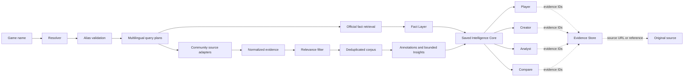

# PlayerVoice


[](https://github.com/feng141368-cyber/PlayerVoice-GameAnalysis-CN/actions/workflows/tests.yml)
[](docs/PLAYERVOICE_MODE_LAYER_IMPLEMENTATION_REVIEW.md)
[](LICENSE)

**Evidence-backed game research, from a game name to traceable player insight.**

PlayerVoice resolves multilingual game names, retrieves official facts and public community evidence, then turns relevant evidence into inspectable insights for players, creators, and analysts. 四种使用视角共享同一个 Intelligence Core；结论保留来源、样本范围与不确定性。

## The Problem It Solves

Game titles and aliases vary by language, while store facts and player opinions come from different sources. PlayerVoice connects those steps without treating missing data as a negative finding or presenting a self-selected public sample as representative.

```text
Game Name → Resolver → Alias Validation → Query Plan → Real Community Evidence
→ Relevance Filter → Deduplicated Corpus → Structured Insight → Original Source
```

Official facts are retrieved as a separate Fact Layer; they are not mixed with player evidence. The runnable path is:



The diagram describes the current implementation: Modes render a saved core snapshot; they do not launch four independent collection pipelines. See [Architecture](ARCHITECTURE.md), [Data Schema](DATA_SCHEMA.md), [Specification](SPECIFICATION.md), and [Issue backlog](ISSUES.md).

## Two Runnable Slices

| Slice | What it does | Example |
| --- | --- | --- |
| Foundation (Issues 1–5) | Resolve identity, validate aliases, build safe multilingual plans, retrieve sourced Steam facts; does not collect UGC. | [`examples/foundation/`](examples/foundation/) |
| Voice Slice (Issues 1–10) | Collect community evidence, record coverage, filter and deduplicate, annotate, and generate evidence-linked Insights. | [`examples/e2e/`](examples/e2e/) |
| Mode Layer (Issues 10.5–14) | Render a saved Voice Slice snapshot for one audience or compare multiple games. | [`examples/modes/`](examples/modes/) |

The two end-to-end commands and a no-recollection Mode render are shown in [Quick Start](#quick-start). Voice Slice collection uses live public routes and can be partial because of credentials, rate limits, or source availability.

## Modes

All four Modes load the same Intelligence Core snapshot, including its facts, evidence store, annotations, Insights, and source coverage.

| Mode | Target user | Main output | Evidence handling | Uncertainty handling |
| --- | --- | --- | --- | --- |
| **Player** | Players evaluating fit or practical requirements | Fact and player-evidence summary, preference profile, dimension-level fit | Claims link to Fact/Insight IDs and underlying evidence | Unsupported preferences stay uncertain; no universal recommendation score |
| **Creator** | Game creators and researchers | Praise, complaints, supported controversy, research questions and gaps | Each claim cites evidence; controversy requires distinct evidence for both positions | Weak disagreement is not promoted to controversy; questions are not findings |
| **Analyst** | Product and research analysts | Evidence-to-interpretation chains, requests, needs, expressed intent, hypotheses | Each stage carries epistemic status and evidence IDs | Public statements are not observed behaviour; business impact remains hypothesis |
| **Compare** | Players, creators, or analysts comparing games | Aligned Fact and taxonomy dimensions with sample coverage | Cells retain evidence, source/language mix, dates, and confidence | Thin or imbalanced samples are insufficient or caution-labelled; no winner score |

Runnable JSON and Markdown outputs are in [`examples/modes/`](examples/modes/). Individual implementation reviews: [Player](docs/ISSUE_11_IMPLEMENTATION_REVIEW.md), [Creator](docs/ISSUE_12_IMPLEMENTATION_REVIEW.md), [Analyst](docs/ISSUE_13_IMPLEMENTATION_REVIEW.md), and [Compare](docs/ISSUE_14_IMPLEMENTATION_REVIEW.md).

## Real Validation

The checked-in Issue 6–10 runs use retrieved public community records, not synthetic demo data. Counts below describe those particular snapshots, not player populations or current platform-wide totals.

| Game | Raw community items | Unique after deduplication | Relevant corpus | Checked-in report |
| --- | ---: | ---: | ---: | --- |
| Infinity Nikki | 52 | 32 | 26 | [`evidence_report.md`](examples/e2e/infinity-nikki/evidence_report.md) |
| PUBG: BATTLEGROUNDS | 43 | 23 | 20 | [`evidence_report.md`](examples/e2e/pubg-battlegrounds/evidence_report.md) |
| Counter-Strike 2 | 46 | 16 | 10 | [`evidence_report.md`](examples/e2e/counter-strike-2/evidence_report.md) |

These runs show why the relevance and provenance steps matter: ambiguous aliases are scoped, unrelated search results are excluded, and duplicate returns retain their query links without inflating the corpus. The checked-in three-game comparison marks all community dimensions insufficient where its evidence floor is not met; it does not force a ranking. See the [Issue 1–5 review](docs/ISSUE_1_5_IMPLEMENTATION_REVIEW.md), [Issue 6–10 review](docs/ISSUE_6_10_IMPLEMENTATION_REVIEW.md), and [Mode Layer review](docs/PLAYERVOICE_MODE_LAYER_IMPLEMENTATION_REVIEW.md) for methods and audits.

## Key Capabilities

- Multilingual game resolution and evidence-backed alias discovery with ambiguity-safe search.
- Multilingual, source-aware query planning and official/store Fact retrieval.
- Community adapters for Steam and Bilibili; an OAuth-aware Reddit adapter.
- Relevance filtering, reviewable exclusions, source-ID deduplication, and a normalized corpus with retained query provenance.
- Versioned taxonomy annotation and evidence-linked, bounded Insights.
- Player, Creator, public-corpus Analyst, and Compare renderers on the shared Intelligence Core.

## Evidence Traceability

Every rendered conclusion can be followed as:

```text
Insight → Evidence ID → stored original text and provenance → Original Source URL/reference
```

The [Evidence Store review](docs/evidence_store.md) describes storage and lookup. The report renderer validates references rather than merely printing evidence-looking IDs.

Keep these layers and labels distinct:

| Label | Meaning |
| --- | --- |
| **Fact Layer** | Sourced, verifiable claims such as platform support or system requirements. |
| **Player Evidence Layer** | Public community records and Insights derived from them; not official facts. |
| **Observed** | What a source states, including an explicit request or expressed intent. It does not prove the described action occurred. |
| **Inferred** | A taxonomy label, pain point, need, or opportunity interpreted from evidence. |
| **Hypothesis** | Possible product or business relevance that requires separate validation. |

Analyst output labels behavioural statements as **expressed intent**, not observed churn. A complaint or association is not evidence of causation.

## Quick Start

Requires Python 3.12 as configured in [CI](.github/workflows/tests.yml). The commands below use the existing `scripts/gamepulse.py` CLI.

### Windows PowerShell

```powershell
py -3 -m venv .venv
.\.venv\Scripts\Activate.ps1
py -3 -m pip install -r requirements.txt
py -3 -m unittest discover -s tests -v

# Foundation: identity, aliases, query plans, and facts; no community collection.
py -3 scripts/gamepulse.py foundation --game "无限暖暖" --locale zh-CN

# Voice Slice: live community collection; source results may be partial.
py -3 scripts/gamepulse.py voice-slice --game "无限暖暖" --output runs/infinity-nikki

# Render Player Mode from the checked-in snapshot; no recollection.
py -3 scripts/gamepulse.py mode --mode player --input-dir examples/e2e/infinity-nikki --preferences "我每天只有一个小时，喜欢剧情和画面，不喜欢重 PvP" --output runs/player-infinity-nikki
```

### Generic Python

```bash
python3 -m venv .venv
source .venv/bin/activate
python3 -m pip install -r requirements.txt
python3 -m unittest discover -s tests -v

python3 scripts/gamepulse.py foundation --game "无限暖暖" --locale zh-CN
python3 scripts/gamepulse.py voice-slice --game "无限暖暖" --output runs/infinity-nikki
python3 scripts/gamepulse.py mode --mode player --input-dir examples/e2e/infinity-nikki --preferences "我每天只有一个小时，喜欢剧情和画面，不喜欢重 PvP" --output runs/player-infinity-nikki
```

The committed baseline is **149 tests**; the CI workflow runs the same unittest suite. `voice-slice` accesses configured/public source routes. Reddit requires OAuth credentials; Bilibili may return partial or rate-limited results. Failures are recorded as unavailable/partial rather than interpreted as no player feedback. The Mode command reads the existing snapshot and does not need source credentials.

## Implemented vs Deferred

| State | Scope |
| --- | --- |
| **Implemented** | Resolver and alias validation; bilingual query planning; Steam Fact retrieval; Steam/Bilibili collection adapters; relevance decisions; SQLite Evidence Store, deduplication, and query links; versioned baseline annotations; evidence-linked Insights and coverage; all four shared-core Modes and CLI outputs. |
| **Partially implemented** | Transparent taxonomy and bilingual rules have limited long-tail/slang recall; Bilibili availability is variable; Reddit adapter execution needs OAuth and was unavailable in the cited validation. |
| **Interface/spec only** | Restricted-source connections without approved credentials/provider/export; authorized private-data ingestion and private/public joins. Contracts and unavailable/fallback boundaries do not mean a connected service or enterprise workflow exists. |
| **Deferred / not implemented** | Dashboard, API server, vector database, private enterprise ingestion, Patch Intelligence or causal patch analysis, and Issue 15+ features. |

No adapter bypasses login, CAPTCHA, rate limits, or platform access controls. Authorized exports or approved providers are required where a source restricts access; graceful fallback and truthful coverage are intentional behavior. No Issue 15 work is included in this repository state.

## Portfolio Highlights

- Modular Python architecture with one shared Intelligence Core.
- Unified typed domain models and checked-in JSON Schemas.
- Provenance-first evidence storage and executable Insight traceback.
- Multilingual resolution, query planning, and baseline annotation.
- Ambiguity-safe alias validation and deterministic failure states.
- Deterministic, network-independent tests; **149/149 baseline**.

Design and implementation references: [Architecture](ARCHITECTURE.md), [Data Schema](DATA_SCHEMA.md), [taxonomy](config/taxonomy.yaml), [source adapter contract](docs/source_adapters.md), [taxonomy gap analysis](docs/taxonomy_gap_analysis.md), and [UGC annotation notes](docs/ugc_annotations.md).

Synthetic behavioural telemetry is retained only under [`demo/`](demo/) for offline SQL demonstrations. Third-party source content remains subject to its platform and author rights. The code and original documentation are licensed under [MIT](LICENSE).
