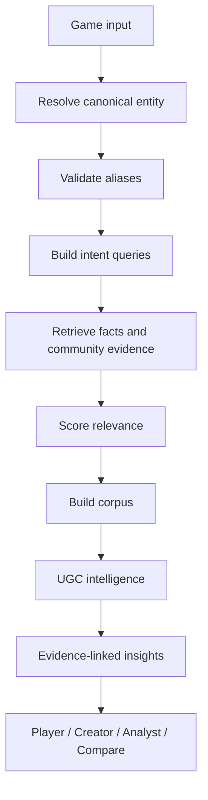
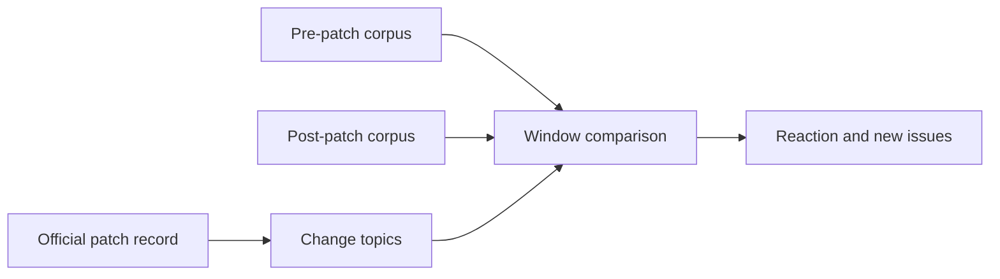

# PlayerVoice product specification

Status: architecture-approved draft for the seven-day MVP. This document defines product behaviour; it does not imply that every described interface is implemented.

## Product definition

PlayerVoice is an evidence-backed game research skill for players, creators, and analysts.

> Search a game once. Understand how it runs, how it plays, what changed, what players think, and why it matters.

The product is not a generic sentiment dashboard. Its core is:

1. game entity resolution;
2. multilingual alias discovery and validation;
3. official fact and patch research;
4. multi-platform public or authorised retrieval;
5. game-relevance filtering;
6. cross-game UGC intelligence;
7. evidence-linked, mode-specific outputs.

## Design principles

- **One Intelligence Core, four modes.** Player, Creator, Analyst, and Compare consume the same canonical entities, evidence, facts, and taxonomy.
- **Fact and player evidence remain separate.** “Official recommended specification” and “players report stuttering” cannot be merged into one unsupported claim.
- **Every material insight is traceable.** Insight → evidence IDs → original source or authorised dataset reference.
- **Recall must not destroy precision.** Ambiguous aliases are never used as standalone queries unless independently validated.
- **Missing access is visible.** A source is `collected`, `partial`, `unavailable`, or `disabled`; unavailable is not negative evidence.
- **Public and private corpora remain isolated.** User-provided data never becomes part of the public corpus or another user's output.
- **Priority is decision support, not causal inference.** Public discussion may suggest a hypothesis; it does not prove retention or revenue impact.
- **The seven-day MVP prefers complete vertical slices.** Future capability is represented by stable interfaces rather than premature implementation.

## Core workflow



## Mode contracts

All modes accept a canonical game reference or a free-text game name. All outputs include `source_coverage`, `limitations`, `generated_at`, and evidence references.

### Player Mode

Purpose: help a player make a preference-aware decision without producing a false universal score.

Input:

```yaml
mode: player
games: ["无限暖暖"]
languages: [zh-CN, en]
preferences:
  likes: [exploration, characters]
  dislikes: [pvp, high_daily_commitment]
  priorities: [combat]
  available_time_minutes_per_day: 60
  hardware: optional free text or structured profile
```

Required output sections:

- `can_i_run_it`: official requirements and separately labelled real-world performance evidence;
- `where_can_i_play_it`: platforms, cross-play, and cross-save facts;
- `how_does_it_play`: keyboard/mouse, controller, touch, and player-reported control quality;
- `look_and_sound`: documented graphics/audio features and subjective player evidence;
- `what_it_is_like`: topic-based experience summary;
- `preference_fit`: likely matches, possible friction, things to consider, uncertainty, and supporting evidence.

PlayerVoice must not collapse this output into a single recommendation score.

### Creator Mode

Purpose: give a reviewer or media creator a research brief, not a pre-written opinion.

Input adds `research_intents`, optional `update_or_patch`, desired communities, and time window.

Required output sections:

- game/update context;
- what players praise;
- what players complain about;
- controversies, including competing positions and evidence strength;
- questions worth investigating;
- open questions and research gaps;
- China/global and platform differences when evidence allows;
- representative evidence linked to original records.

### Analyst Mode

Purpose: turn authorised player voice into research hypotheses, product opportunities, and investigation priorities.

Input may add authorised private dataset IDs, segments, time windows, versions, and comparison cohorts.

Required analytical chain:

`raw_statement → pain_point → underlying_need → behaviour_signal → business_impact_hypothesis → product_opportunity → priority`

`explicit_feature_request` and `inferred_product_opportunity` are separate fields. Behaviour signals and business impact are hypotheses unless supported by first-party behavioural data.

### Compare Mode

Purpose: align multiple games on one taxonomy and explain meaningful differences.

Input:

```yaml
mode: compare
games: ["原神", "鸣潮", "无限暖暖"]
preferences:
  available_time_minutes_per_day: 60
  likes: [exploration, story]
  dislikes: [pvp]
  indifferent_to: [meta_strength]
```

Output includes a normalized comparison matrix, source/date coverage per game, evidence-supported differences, preference matches, possible friction, uncertainty, and non-comparable gaps. Missing evidence never receives a neutral score.

## Patch Intelligence

Patch Intelligence is a horizontal capability, exposed first as an interface and implemented after the base corpus is reliable.



It answers what changed, which prior complaints the patch appears to address, how topic/sentiment/bug-report signals differ before and after, what new issues appear, and where evidence is insufficient. It must use temporal language such as “after the patch” rather than causal language unless causal evidence exists.

## Private data ingestion

Accepted future inputs: CSV, JSON, Excel/exported data, internal reviews, surveys, support feedback, authorised community exports, and research datasets.

Every dataset receives an explicit owner/scope, provenance, schema mapping, retention policy, and permitted modes. Private records are stored in a separate corpus namespace and are excluded from public retrieval by default. Combined analysis labels public and private evidence separately.

## Seven-day MVP

### P0 — contracts and discovery

- canonical Game Resolver;
- alias discovery, validation, ambiguity, and search-safety;
- multilingual, intent-aware Query Builder;
- official Fact Layer;
- evidence/provenance contracts.

### P1 — first complete intelligence slice

- shared source adapter protocol;
- two to four adapters, prioritising official sources, Steam, Reddit, Bilibili, and one accessible Chinese game community;
- relevance filtering;
- corpus construction and deduplication;
- core multi-label UGC taxonomy and evidence-linked insights.

### P2 — thin user-facing modes

- Player Mode;
- Creator Research Brief;
- basic Compare Mode.

### P3 — specified, not required for week one

- advanced Analyst Mode;
- Patch Intelligence;
- Private Data Ingestion;
- advanced dashboard.

## MVP non-goals

- implementing every platform adapter;
- bypassing login, CAPTCHA, anti-bot controls, or platform restrictions;
- a universal “recommended score”;
- causal attribution from public comments;
- fully automated high-stakes product decisions;
- a production multi-tenant privacy system;
- a dashboard before the core evidence contracts are stable.

## Success criteria

- three games can be resolved from different name forms, including one ambiguous alias case;
- each chosen game produces official facts plus at least two collected community sources where access permits;
- every surfaced insight links to evidence records and the collection run;
- Fact Layer and Player Evidence Layer are never merged without labels;
- a source failure remains visible and does not invalidate available sources;
- Player and Creator outputs can be generated from the same corpus without duplicating collection logic.
